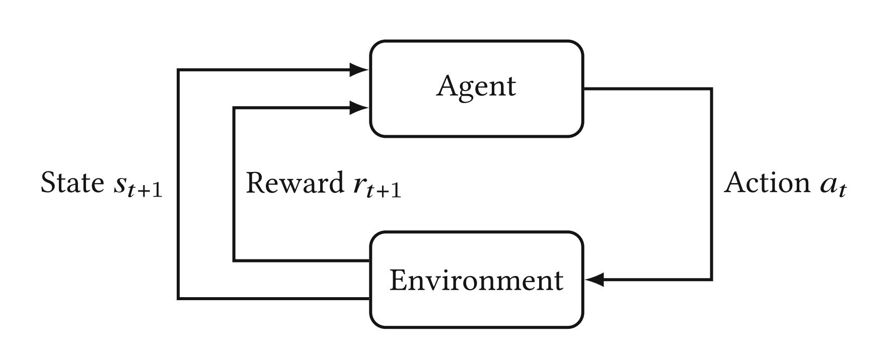

# Chapter 2: Core Concepts - Key Notes

## Fundamental RL Components

### Core Concepts
- **Agent**: The decision-maker that learns and takes actions
- **Environment**: The world in which the agent operates and receives feedback
- **Action (A)**: Choices available to the agent at each step
- **Policy (π)**: Strategy/function that maps states to actions (the agent's behavior)
- **State (S)**: Current situation or configuration of the environment
- **Reward (R)**: Immediate feedback signal from the environment
- **Value (V)**: Expected cumulative reward from a given state (long-term perspective)

### The Agent-Environment Loop

The fundamental cycle of reinforcement learning:
1. Agent observes current state `s_t`
2. Agent selects action `a_t` based on policy `π(a|s)`
3. Environment transitions to new state `s_{t+1}` and provides reward `r_{t+1}`
4. Process repeats with agent learning from experience

## Sequential Decision Problems

**Objective**: Find a sequence of decisions that maximizes cumulative reward over time

### Examples of Sequential Decision Problems:
- **Grid worlds**: Navigate through a grid to reach goal states
- **Mazes and box puzzles**: Find optimal paths while avoiding obstacles
- **Game playing**: Make moves that lead to winning outcomes

### RL Paradigm
The reinforcement learning cycle: Agent takes Action → Environment responds → Agent learns from feedback → Repeat

## Markov Decision Process (MDP)

### Markov Property
**Key Insight**: The future depends only on the present, not the past
- Next state depends solely on current state and chosen action
- No need to remember historical states or external information
- Mathematically: 

P(S_{t+1} | S_t, A_t, S_{t-1}, ..., S_0) = P(S_{t+1} | S_t, A_t)

### MDP 5-Tuple Definition
An MDP is formally defined as: 

⟨ S, A, T, R, γ ⟩

1. **S**: Set of all possible states
2. **A**: Set of all possible actions  
3. **T**: Transition function - P(s'|s,a) = probability of reaching state s' from state s taking action a
4. **R**: Reward function - R(s,a,s') = immediate reward for transition
5. **γ (Gamma)**: Discount factor (0 ≤ γ ≤ 1)
   - Controls importance of future vs. immediate rewards
   - γ = 0: Only immediate rewards matter
   - γ = 1: All future rewards equally important
   - γ < 1: Future rewards are discounted

## Value Functions & Bellman Equations

### State Value Function
**V^π(s)**: Expected cumulative discounted reward starting from state s following policy π

V^π(s) = E_π[G_t | S_t = s] = E_π[Σ_{k=0}^∞ γ^k R_{t+k+1} | S_t = s]

### Action Value Function (Q-Function)
**Q^π(s,a)**: Expected cumulative discounted reward starting from state s, taking action a, then following policy π

Q^π(s,a) = E_π[G_t | S_t = s, A_t = a]

### Bellman Equations

#### Bellman Equation for State Values

V^π(s) = Σ_a π(a|s) Σ_{s'} P(s'|s,a) [ R(s,a,s') + γ V^π(s') ]

**Intuition**: Value of current state = immediate reward + discounted value of next states

#### Bellman Equation for Action Values

Q^π(s,a) = Σ_{s'} P(s'|s,a) [ R(s,a,s') + γ Σ_{a'} π(a'|s') Q^π(s',a') ]

#### Bellman Optimality Equations
For optimal policy π*:

V^*(s) = max_a Σ_{s'} P(s'|s,a) [ R(s,a,s') + γ V^*(s') ]

Q^*(s,a) = Σ_{s'} P(s'|s,a) [ R(s,a,s') + γ max_{a'} Q^*(s',a') ]

## Traces and Eligibility

### Eligibility Traces
**Purpose**: Bridge between temporal difference (TD) and Monte Carlo methods
- Assign credit to states/actions that led to rewards
- Decay over time based on recency and frequency of visits

### Trace Types
1. **Accumulating Traces**: 

    e_t(s) = γλ e_{t-1}(s) + 1(S_t = s)

2. **Replacing Traces**: 

    e_t(s) = 
      if S_t ≠ s:   γλ e_{t-1}(s)
      if S_t = s:   1

Where:
- λ (lambda): Trace decay parameter (0 ≤ λ ≤ 1)
- 1(S_t = s): Indicator function (1 if true, 0 otherwise)

### Benefits of Traces
- **Faster learning**: Credit assignment happens immediately
- **Better sample efficiency**: One experience updates multiple states
- **Smooths learning**: Reduces variance in value estimates

## Key Mathematical Relationships

### Return (Cumulative Reward)

G_t = R_{t+1} + γ R_{t+2} + γ^2 R_{t+3} + ... = Σ_{k=0}^∞ γ^k R_{t+k+1}

### Policy Relationship

V^π(s) = Σ_a π(a|s) Q^π(s,a)

Q^π(s,a) = Σ_{s'} P(s'|s,a) [ R(s,a,s') + γ V^π(s') ]

## Important Insights

1. **Markov Property** enables efficient computation - we don't need infinite memory
2. **Discount factor** balances immediate vs. future rewards and ensures convergence
3. **Bellman equations** provide recursive relationships that enable dynamic programming
4. **Value functions** capture the long-term desirability of states and actions
5. **Traces** provide a mechanism for efficient credit assignment across time

## Questions & Reflections

- How does the discount factor γ affect learning behavior in different environments?
- When might the Markov assumption be violated in real-world problems?
- How do eligibility traces change the learning dynamics compared to basic TD methods?
- What's the relationship between policy evaluation and the Bellman equation?
